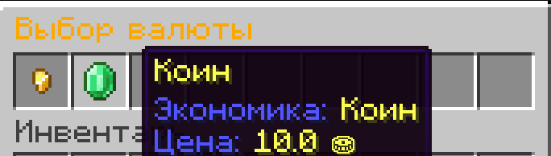

# 🪙 CrazyAuctions Fork — include CoinsEngine

> ⚠️ **Fork Disclaimer**  
> This is **not an official release** of the [CrazyAuctions](https://github.com/Crazy-Crew/CrazyAuctions) plugin.  
> It is a **community fork** that adds **support for [CoinsEngine](https://www.spigotmc.org/resources/coinsengine.84121/)**  
> to enable in-game currency integration.  
> All credits for the original code and design go to the **CrazyCrew** developers.

> ✅ Tested on **Minecraft 1.21.10 (Paper)**.  
> Compatibility with other versions is **not guaranteed**.

---

## ✨ New Features

This fork extends the original CrazyAuctions by adding support for CoinsEngine currencies, allowing players to use multiple in-game currencies for auctions instead of just Vault economy.

---

## ⚙️ Configuration

### Enabling CoinsEngine Support

To use CoinsEngine currencies instead of Vault, modify your `config.yml`:

```yaml
Settings:
  CoinsEngineSupport:
    enable: true  # Set to true to use CoinsEngine currencies
    currencies:
      - 'money'    # First currency (primary)
      - 'coins'    # Second currency
      - 'gems'     # Third currency, etc.
  defaultCurrencySymbol: '$' # Currency symbol displayed next to %price% by default (if CoinsEngine is not enabled or currency is not found)
  GUISettings:
    Currency:
      Title: '&6Choose currency'
      Lore:
        - '&9Currency: &e%currency%'
        - '&9Price: &e%price%'
```

### Configuration Details

- **CoinsEngineSupport.enable**: Set to `true` to activate CoinsEngine integration
- **CoinsEngineSupport.currencies**: List of currency IDs from your CoinsEngine config
    - Players can choose from all listed currencies when creating auctions
- **defaultCurrencySymbol**: Displayed when CoinsEngine is disabled or currency not found
- **GUISettings.Currency**: Controls the currency selection interface

---

## 🎮 Usage

When CoinsEngine support is enabled:

1. **Creating Auctions**: Players can select which currency to use for their auction
2. **Bidding**: Bids are placed using the selected currency
3. **Currency Display**: Prices show the appropriate currency symbol and name
4. **Multiple Currencies**: Auctions can use different currencies

---

## 📸 Screenshots



---

## 🔄 Migration from Vault

- When switching to CoinsEngine, existing auctions will use Vault
- Set `CoinsEngineSupport.enable: false` to continue using Vault

---

## 💰 Currency Display

When CoinsEngine support is enabled:

- **Icons/Symbols**: Currency icons and symbols are loaded directly from CoinsEngine's configuration
- **Display Names**: Currency names (singular/plural) use the display names defined in CoinsEngine
- **Fallback**: If a currency is not found in CoinsEngine, the plugin falls back to `defaultCurrencySymbol`

The integration automatically pulls all visual elements (icons, names) from your CoinsEngine configurations.

---

## ❓ Troubleshooting

**CoinsEngine currencies not showing?**
- Verify CoinsEngine is installed and working
- Check that currency IDs match in both configs
- Ensure `CoinsEngineSupport.enable: true`

**Currency symbols not displaying?**
- CoinsEngine uses its own display names and colors
- `defaultCurrencySymbol` is only used as fallback

**Transactions failing?**
- Ensure players have sufficient balance in the specific currency
- Check CoinsEngine permissions

```
This completes the README with comprehensive configuration instructions for the new CoinsEngine functionality.
```

<center><div align="center">


[![Contributors][contributors-shield]][contributors-url]
[![Forks][forks-shield]][forks-url]
[![Stargazers][stars-shield]][stars-url]
[![Issues][issues-shield]][issues-url]
[![MIT License][license-shield]][license-url]
[](https://www.codefactor.io/repository/github/crazy-crew/crazyauctions)

<big>**Auction off your items in style!**</big>

<big>**Quick Links**</big><br>
[Request Features](https://github.com/Crazy-Crew/CrazyAuctions/issues)<br>
[Documentation](https://docs.crazycrew.us/docs/category/crazyauctions)<br>
[Developer API](https://docs.crazycrew.us/docs/plugins/crazyauctions/guides/api/intro)<br>
[Report Bugs](https://github.com/Crazy-Crew/CrazyAuctions/issues)<br>
[Trello Board](https://trello.com/b/B9exh23d/crazyauctions)

<big>**Supported Platforms**</big><br>
[](https://papermc.io/)
[](https://purpurmc.org/)

<big>**Initial Plugin Setup**</big><br>
CrazyAuctions as first install will come with a set of default files such as `config.yml`, `messages.yml`
You can simply edit these files, and configure the looks and settings then do `/crazyauctions reload`<br>

<br>
**Selling/buying/bidding items with ease.**<br>
**Easy to use configurations.**<br>
**Max/min bidding/buying.**<br>
**Customizable category selector.**<br>
**Blacklist items you don't want to be auctioned off.**<br>
**Cancel auctions & retrieve the item afterward.**<br>
**And much more!**<br>

<br>
Are you confused about something? Hop by the Discord and you might just get an answer!<br>
Please head to [crazy-auctions](https://discord.com/channels/182615261403283459/1178545378564509786) with your question and do not cross post.<br>

<details>
<summary>Support Checklist</summary>

Please check to make sure that your question wasn't asked before, You can use `Ctrl+F` on Discord to look for past conversations.<br>
Describe your issue in detail, Don't just make it a bread crumb trail that has to be questioned out of you.<br>
Plugin Version i.e. `CrazyAuctions 3.3` **LATEST DOES NOT COUNT**<br>
Server Version & Server Type i.e. `Paper 1.21.1` or `Purpur 1.21.1` **LATEST DOES NOT COUNT**<br>
Send any console errors or files you have through https://mclo.gs/ - (We don't own the website, You have to copy the link and send it.)<br>
</details>

<!--[](https://discord.gg/badbones-s-live-chat-182615261403283459)<br>-->
[](https://discord.gg/badbones-s-live-chat-182615261403283459)
</div>


</center>

[contributors-shield]: https://img.shields.io/github/contributors/Crazy-Crew/CrazyAuctions.svg?style=flat&logo=appveyor
[contributors-url]: https://github.com/Crazy-Crew/CrazyAuctions/graphs/contributors
[forks-shield]: https://img.shields.io/github/forks/Crazy-Crew/CrazyAuctions.svg?style=flat&logo=appveyor
[forks-url]: https://github.com/Crazy-Crew/CrazyAuctions/network/members
[stars-shield]: https://img.shields.io/github/stars/Crazy-Crew/CrazyAuctions.svg?style=flat&logo=appveyor
[stars-url]: https://github.com/Crazy-Crew/CrazyAuctions/stargazers
[issues-shield]: https://img.shields.io/github/issues/Crazy-Crew/CrazyAuctions.svg?style=flat&logo=appveyor
[issues-url]: https://github.com/Crazy-Crew/CrazyAuctions/issues
[license-shield]: https://img.shields.io/github/license/Crazy-Crew/CrazyAuctions.svg?style=flat&logo=appveyor
[license-url]: https://github.com/Crazy-Crew/CrazyAuctions/blob/main/LICENSE